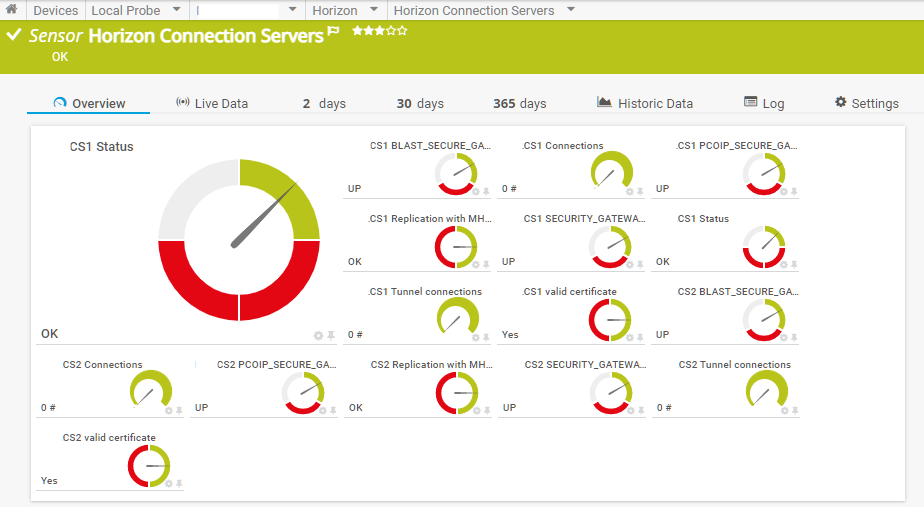
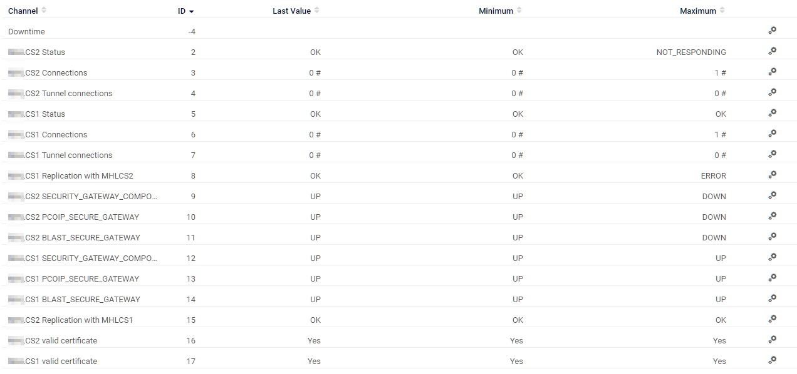
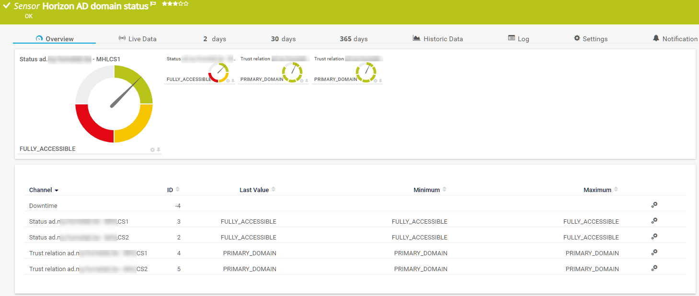
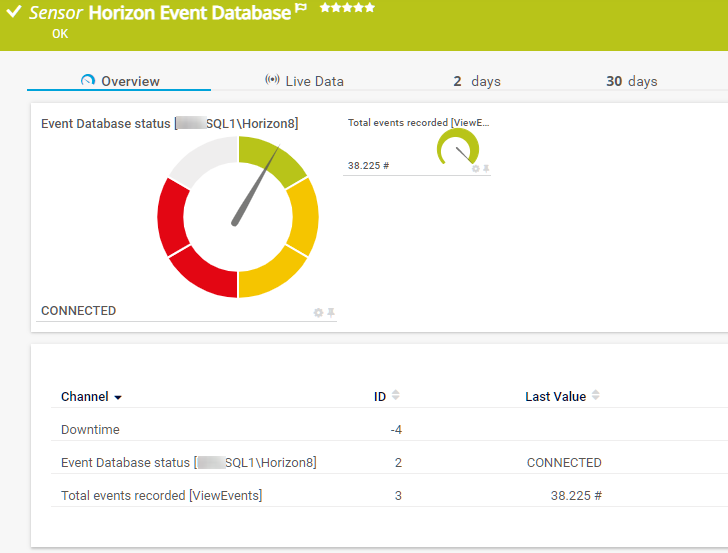

# PRTG Powershell scripts to monitor VMware Horizon environment
Here's a collection of powershell scripts that you can you as PRTG Custom sensors to monitor your VMware Horizon environment
## REQUIREMENTS
The scripts all use the [PRTG-CSRClass](../PRTG-CSR/) script to generate the correct PRTG JSON string

The scripts all use the Horizon-Functions.ps1 script

In most scripts channels are created with a custom lookup value. The custom lookup files can be found [here](../PRTG-Lookups/)
## Installation
Copy the powershell script(s) to the following location: `<PRTG installation folder>\custom\exexml\` (this has to be done on each probe where you want to use this script)

Download the [PRTG-CSRClass](../PRTG-CSR/) (not necessary if you'll adjust the scripts for another monitoring system)

Download the Horizon-Functions.ps1 that contains common functions for all scripts (non-PRTG related functions)

Download the [PRTG Custom Lookup files](../PRTG-Lookups/) 

1. Create a new device in PRTG pointing to a Horizon Connection server (or the loadbalancer). 
2. Add a new sensor: "EXE/Script advanced"
3. Choose the correct script you want for this sensor
4. Enter the necessary parameters. You can use PRTG placeholders: e.g. `-HVUrl https://%host -HVUser %windowsuser -HVPass %windowspassword -HVDomain %windowsdomain`    
  This wil take the values for user, password, host, ... from the information entered in PRTG on the sensor or parent group. Of course, you can also specify a fixed value in the parameters instead of using PRTG placeholders.

You can also test the scripts by running them manually in powershell and passing the necessary parameters (-HVUrl, -HVUser, -HVPass & -HVDomain)

There's an option to store the password in a secure way and retrieve it by the scripts in stead of passing it as a parameter each time you run the script. This can be done by: 
1. In the sensor settings, enter the password as a parameter and also provide the -SavePassword switch: `-HVUrl https://%host -HVUser %windowsuser -HVDomain %windowsdomain -HVPass %windowspassword -SavePassword`
2. Let the sensor run at least once. If the password is correct and saved, the sensor will go into error status stating the password has been saved and you need to remove the -SavePassword switch now.
3. adjust the parameters of the sensor and remove the `-HVPass %windowspassword` and `-SavePassword` parameters. The script will now run using the saved password. The only parameters that are still required now are the url, user and domain. 

By Default, when the script gets an access token from the REST API, it will also be saved in an encrypted way and be re-used by the same and other Horizon PRTG monitoring scripts the next time. This eliminates the need to do a REST API Login request each time one of the scripts is run. By default the access token is valid for 30 minutes and can be renewed with the refresh token, which is valid for 8 hours. If both tokens are expired, a new login request will be done to get new access and refresh tokens. If you don't want to save and re-use the tokens, set the parameter -SaveToken to $false (default = $true).

The password and tokens are saved in an encrypted format that can only be decrypted by the user that saved the password (by default the user that runs the PRTG Probe service) and only on the computer where the password was saved. The data is saved to horizon-functions.dat in the same folder as the horizon-functions.ps1. You can change the location of the file by using the parameter `-SecureFile "path\file.name"`.
### List of available scripts
#### Horizon-Functions.ps1
This script contains some general functions that are used by all other scripts here. Put it in the same location where you put the other scripts.
#### PRTG-HorizonCS.ps1
This script shows the status of the connection servers in your environment in a single sensor, using different channels

#### PRTG-HorizonAD.ps1
This script shows the AD domain status of the connection servers in your environment

#### PRTG-HorizonEventDB.ps1
This script shows the status of the event database in your environment

